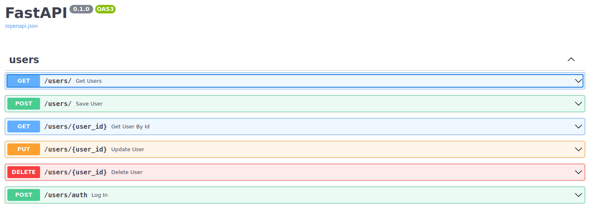

## Authentication System (sample)
This is a simple API for basic user authentication. 



## Installing dependencies with pip:
```console
foo@bar:~$ pip install -r requirements.txt
```

### Running Uvicorn ASGI Server:
```console
foo@bar:~$ uvicorn main:app
```


